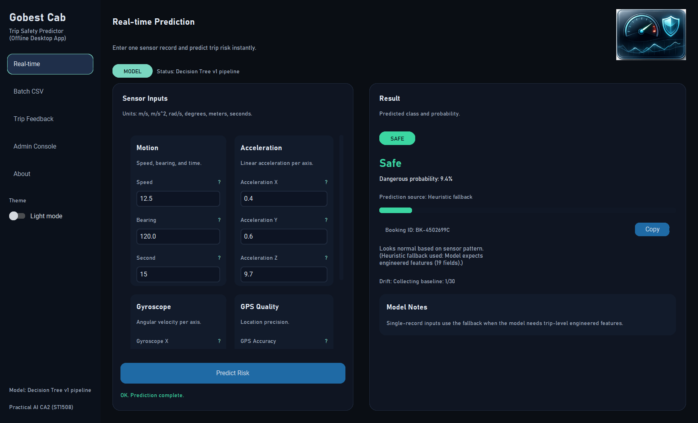
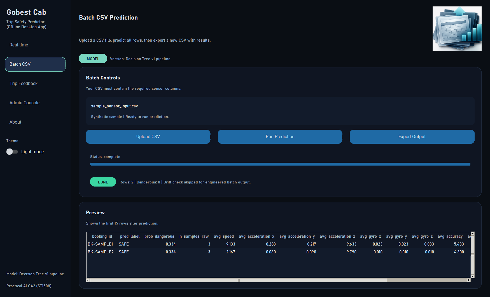
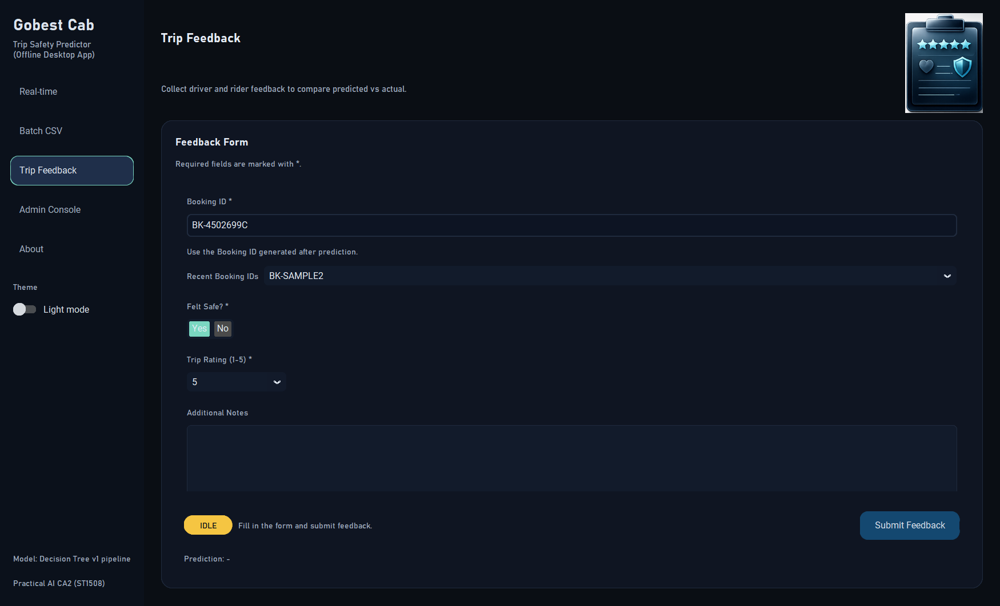
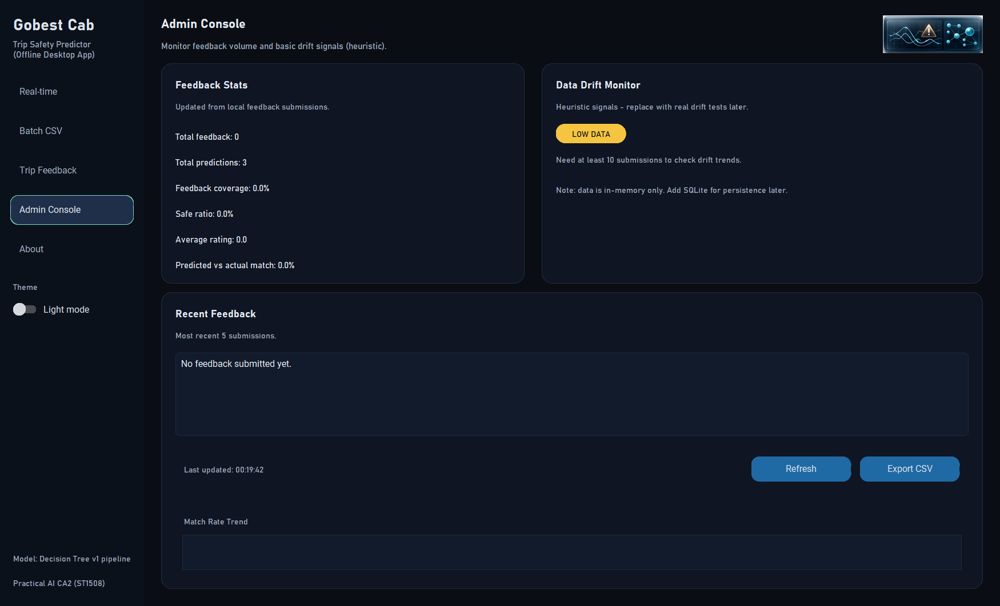

# Gobest Cab Trip Safety Predictor

Offline Python desktop app for trip-safety prediction from vehicle sensor data. It supports single-record demo predictions, batch CSV inference, feedback collection, basic drift checks, and a bundled decision-tree model artifact.

This project was created for Singapore Polytechnic DAAA Practical AI CA2 (ST1508) by Goh Kun Ming, Goh Jenson, Liu Xingyu, and Law Wei Tin under Lecturer Liu Zheng.

> This is an educational project. It is not intended for real-world safety, insurance, dispatch, enforcement, or employment decisions.

## Screenshots

Screenshots are captured from the running desktop app and stored under `docs/screenshots/`.

| Real-time | Batch |
| --- | --- |
|  |  |

| Feedback | Admin |
| --- | --- |
|  |  |

## Features

- Offline CustomTkinter desktop interface.
- Real-time single-record prediction with explicit source labeling.
- Batch CSV prediction with booking IDs and exportable outputs.
- Behaviour-level feature engineering for trip-level sensor records.
- Feedback capture and lightweight local admin dashboard.
- Pytest suite, GitHub Actions CI, and Windows executable build workflow.

## Quick Start

Requires Python 3.11+.

```powershell
python -m venv .venv
.\.venv\Scripts\Activate.ps1
python -m pip install --upgrade pip
python -m pip install -r requirements.txt
python -m app.main
```

Run tests:

```powershell
python -m pytest -q
```

Run lint checks:

```powershell
python -m pip install -r requirements-dev.txt
python -m ruff check .
```

## CSV Input Schema

Batch CSVs can contain raw sensor records. Column matching is case-insensitive.

Required raw columns:

- `booking_id` or `bookingID` for trip grouping
- `speed`
- `acceleration_x`, `acceleration_y`, `acceleration_z`
- `gyro_x`, `gyro_y`, `gyro_z`
- `accuracy` or `accuracy_m`
- `bearing` or `bearing_deg`
- `second`

If no booking ID is supplied, the app treats each row independently and generates local booking IDs. See [examples/sample_sensor_input.csv](examples/sample_sensor_input.csv).

## Model Behaviour

The bundled `decision_tree_pipeline.joblib` expects trip-level engineered features such as `fe_n_samples`, `fe_trip_duration_s`, and driving-behaviour rates. Batch CSVs with booking IDs are aggregated into those features before prediction.

Single-record real-time inputs do not contain enough trip history for that model, so the app labels those predictions as a heuristic fallback. This is deliberate and documented in the UI, model card, and tests.

Never load untrusted `.joblib` or pickle artifacts. See [docs/MODEL_CARD.md](docs/MODEL_CARD.md).

## Project Structure

```text
app/
  core/       prediction, validation, preprocessing, batch, drift, store
  ui/         CustomTkinter pages, theme, widgets, assets
tests/        pytest suite
docs/         architecture, data notes, model card, screenshots
examples/     synthetic CSV examples
```

Private submission documents, raw notebooks, generated caches, and executable artifacts are intentionally excluded from git.
